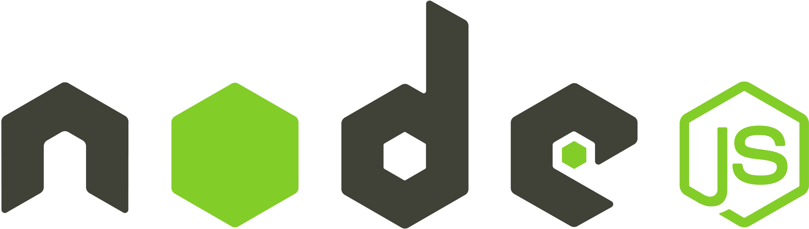

<h1 align="center">
  <a href="https://github.com/csorlandi/nodejs-concepts">
    
  </a>
</h1>

<p align="center">
  <a href="#technologies">Technologies Used</a>&nbsp;&nbsp;&nbsp;|&nbsp;&nbsp;&nbsp;
  <a href="#run">How to run the API</a>&nbsp;&nbsp;&nbsp;|&nbsp;&nbsp;&nbsp;
  <a href="#contribute">How to contribute</a>&nbsp;&nbsp;&nbsp;|&nbsp;&nbsp;&nbsp;
  <a href="#license">License</a>
</p>

<p align="center">
  

  

  
</p>

<br>

## :books: About


It's an API that makes financial transactions.

Services:

* Create transactions
* Read transactions


<a id="technologies"></a><br>

## ⚒️ Technologies Used
  * Node.js
  * TypeScript
  * Express

<a id="run"></a><br>

## 🚀 How to run the API

- Clone this repository

```
git clone https://github.com/RuthMaria/gostack-node-fundamentals.git
```

- Install dependencies

```
yarn 
```

- Run the API

```
yarn dev:server
```

- Run the tests

```
yarn test
```

<br>

## 🎯 How to contribute

- Fork this repository,
- Create a branch with your feature: `git checkout -b my-feature`
- Commit your changes: `git commit -m 'feat: My new feature'`
- Push your branch: `git push origin my-feature`

<a id="license"></a><br>

## :memo: License

This project is under the MIT license. See the  file [LICENSE](LICENSE) for more details.

---

<h4 align="center">
    Developed with ❤️ by <a href="https://www.linkedin.com/in/ruth-maria-9b256071/" target="_blank">Ruth Maria</a>
</h4>
